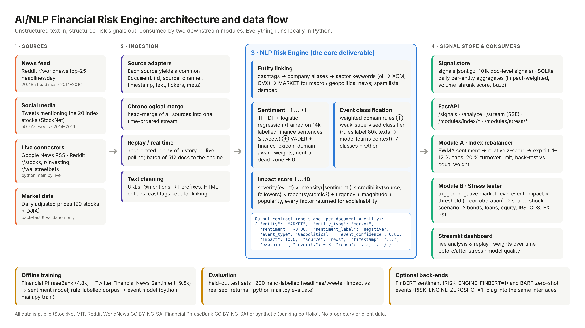

# AI/NLP Financial Risk Engine - S&P Global & Crisil Campus Hackathon

**Candidate Name:** D Maithreya

**College Email ID:** dmaithreya.241ai013@nitk.edu.in

**College / Campus:** National Institute of Technology Karnataka (NITK), Surathkal

**Demo Video Link:** _[add the unlisted YouTube link here]_

**Slide Deck Link (if hosted externally):** [`docs/presentation.pdf`](docs/presentation.pdf) (in this repo)

---

## 1. Project Overview / Problem Statement & Approach

Markets react to news within minutes, but most of that news is unstructured text: headlines, wire stories and social-media posts. Risk desks need it as **numbers a machine can act on**. This project builds a **unified AI/NLP Risk Engine**. It ingests text from two different sources (a news feed and Twitter) and turns every document into a structured, explainable risk signal:

| Field | Range | How it is produced |
|---|---|---|
| **Sentiment Score** | -1.0 … +1.0 (0 = neutral) | A TF-IDF + logistic-regression model trained on 14k labelled finance sentences and tweets, combined with a finance-tuned VADER lexicon. The weights are tuned per source and per domain. |
| **Event Classification** | Geopolitical, Macroeconomic, Credit Event, Merger/Acquisition, Product Launch, Earnings, Regulatory/Legal, Other | Weighted domain rules plus a weakly supervised classifier. The rules label 80k unlabelled texts, and the model learns the surrounding context from them. |
| **Impact Score** | 1 … 10 | A transparent model: event severity × sentiment intensity × source credibility × systemic reach, plus urgency, magnitude and popularity terms. Every factor is returned in `explain`. |

Signals are linked to entities: a company via its cashtag or name, a sector via keywords (e.g. "oil" → XOM, CVX), or the whole **MARKET** for macro and geopolitical news. They are published to a signal store (JSON-lines, SQLite and daily aggregates) and through a **FastAPI** service.

**Both** downstream modules are implemented on top of the engine:

* **Module A: Tactical index rebalancer.** A 20-stock S&P 100 index whose weights tilt every day towards stocks with positive news and away from stocks with negative news. The tilt uses smoothed, cross-sectionally standardised sentiment, with weight caps and a turnover limit. It is back-tested against equal weight with no look-ahead.
* **Module B: Strategic stress tester.** A synthetic wholesale-banking book of 203 trades worth $8.1bn: loans, corporate and sovereign bonds, equity, interest-rate swaps, CDS and FX forwards. When the engine detects a negative, market-wide, high-impact event (e.g. *Geopolitical, impact > 7*), the matching shock scenario is scaled by the impact score and revalued trade by trade.

A **Streamlit dashboard** ties it together. You can analyse any headline live, replay the historical stream in "real time", watch index weights change over time, and see portfolio value before and after a stress event.

## 2. Architecture & Tech Stack



**Data flow:** sources → ingestion adapters (common `Document` schema, chronological merge, replay or live polling) → NLP engine (cleaning → entity linking → event classification → sentiment → impact) → signal store → API, Module A, Module B → dashboard.

| Layer | Tech |
|---|---|
| NLP / ML | scikit-learn (TF-IDF word + char n-grams, logistic regression), vaderSentiment, regex rule engine. Optional: HuggingFace FinBERT and BART zero-shot (`requirements-finbert.txt`) |
| Data | pandas, NumPy, SQLite, gzipped JSON-lines |
| Serving | FastAPI + Uvicorn (REST and Server-Sent-Events stream) |
| Live ingestion | feedparser (Google News RSS), requests (Reddit JSON) |
| UI | Streamlit + Plotly |
| Quality | pytest (20 tests), evaluation script with held-out and hand-labelled sets |

```
src/
  config.py                 universe, taxonomy, thresholds, parameters
  engine/
    ingestion/sources.py    StockNet tweets, Reddit news, Google News RSS, Reddit live, merge/replay
    nlp/text.py             cleaning, cashtags
    nlp/entities.py         entity linking (company / sector / market)
    nlp/sentiment.py        TF-IDF-LR model + finance lexicon ensemble (+ optional FinBERT)
    nlp/events.py           rule tagger + weak-supervised classifier (+ optional zero-shot)
    nlp/impact.py           explainable impact score
    engine.py               RiskEngine: Document(s) -> RiskSignal(s)
    aggregate.py, store.py  daily aggregation, JSONL / SQLite store
    train.py, pipeline.py   model training, batch pipeline
  modules/rebalancer.py     Module A + back-test
  modules/stress/           Module B: scenarios.py (shock library), engine.py (valuation, triggers)
  api/main.py               FastAPI service
  dashboard/app.py          Streamlit dashboard
scripts/                    prepare_data.py, generate_portfolio.py, evaluate.py
tests/                      unit tests
```

## 3. Dataset Used

All data is **public or synthetic**. No proprietary or client data is used. See [`data/README.md`](data/README.md) for details.

| Data | Source | Size |
|---|---|---|
| **Social media (source 1)** | Real tweets mentioning the 20 index stocks, Jan 2014 – Mar 2016. From StockNet (Xu & Cohen, ACL 2018, MIT licence) | 59,777 tweets |
| **News feed (source 2)** | Top-25 daily Reddit r/worldnews headlines, same period. From Kaggle's *Daily News for Stock Market Prediction* | 20,485 headlines |
| Prices | Daily adjusted closes of the 20 stocks + DJIA (StockNet / Yahoo Finance) | 577 days |
| Sentiment training | Financial PhraseBank v1.0 (expert-labelled) + Twitter Financial News Sentiment (labelled tweets) | 4,838 + 9,543 |
| Event / sentiment evaluation | 200 headlines and tweets from the two sources, labelled by hand (`data/eval/event_gold.csv`) | 200 |
| Banking portfolio | Synthetic trades (`scripts/generate_portfolio.py`, seed 42), fictional counterparties | 203 trades, $8.1bn |

**Assumptions**

* Reddit headlines only carry a date, so they are spread across the trading day for the replay.
* Signals published after the US close (21:00 UTC) count towards the next day, which avoids look-ahead in the back-test.
* Long-run average 1-year PDs by rating are used for the loan book.
* Stress shocks are simplified, sensitivity-based versions of regulatory adverse scenarios.

## 4. Quickstart & Installation

Runtime: Python 3.10+ (tested on Python 3.13, Linux). No GPU or API keys needed. Trained models and processed signals are committed, so the dashboard works straight after install.

```bash
git clone https://github.com/md2505/nitk-d-maithreya-hackathon.git
cd nitk-d-maithreya-hackathon
python -m venv .venv && source .venv/bin/activate      # Windows: .venv\Scripts\activate
pip install -r requirements.txt

python main.py dashboard        # -> http://localhost:8501  (the demo)
python main.py api              # -> http://localhost:8000/docs  (REST API, second terminal)
```

Reproduce everything from the raw data:

```bash
python main.py train            # train sentiment + event models          (~2 min)
python main.py pipeline         # run the engine over 80k documents        (~1 min)
python main.py evaluate         # model quality + impact validation
python main.py backtest         # Module A back-test
python main.py stress --event "Credit Event" --impact 9   # Module B from the command line
python main.py live             # score live Google News + Reddit posts (needs internet)
python -m pytest -q             # 20 unit tests
```

Example API calls:

```bash
curl -X POST localhost:8000/analyze -H "content-type: application/json" \
     -d '{"text": "Greece defaults on IMF loan as bailout talks collapse"}'
curl -X POST localhost:8000/modules/stress/run -H "content-type: application/json" \
     -d '{"event_type": "Geopolitical", "impact": 8.5}'
curl "localhost:8000/signals?entity=AAPL&min_impact=6&limit=5"
curl -N "localhost:8000/stream?start=2014-03-01&end=2014-03-03&speed=10"   # live SSE replay
```

Optional transformer back-ends: `pip install -r requirements-finbert.txt`, then set `RISK_ENGINE_FINBERT=1` and/or `RISK_ENGINE_ZEROSHOT=1`.

## 5. Key Results & Domain Impact

**What the prototype outputs:** 101,437 structured signals from 60,388 documents. Every signal has sentiment, event type, impact and an explanation.

**Signal quality** (all numbers are in `models/metrics.json` and the dashboard's *Model quality* tab)

| Test | Naive baseline | This engine |
|---|---|---|
| Sentiment, Financial PhraseBank hold-out (968 news sentences) | VADER 54.3% accuracy | **78.6%** (TF-IDF-LR) |
| Sentiment, financial tweets hold-out (1,909 tweets) | VADER 49.0% | **80.0%** (ensemble) |
| Sentiment, hand-labelled world-news headlines (92, out-of-domain) | supervised model alone 32.6% | **47.8%** with domain-aware routing (finance lexicon alone: 59.8%) |
| Event classification, 200 hand-labelled texts | rules alone 67.0% | **67.5%** hybrid (macro-F1 0.60) |
| Impact score vs same-day absolute return (companies) | impact 1–3: 0.92× a typical move | impact 5–7: **1.25×**, impact 7–10: **1.14×** |
| Daily sentiment vs same-day return | | Positive days **+0.41%**, negative days **−0.37%** (Spearman 0.12) |

**Module A** (Jan 2014 – Apr 2016, 566 trading days, daily rebalancing, 5 bp costs): the sentiment index returned **22.2% vs 22.3%** for equal weight. Tracking error was 1.5%, average turnover 3.7% a day, and weights ranged between about 3% and 9%. Before costs it returned 23.5% (information ratio 0.30). The tilts follow the news without paying away much return, but turnover costs use up most of the small edge.

**Module B** (severe-case losses on the $8.1bn book; impact 8.5 means 75% of the severe scenario):

| Trigger | Loss | % of book | Main driver |
|---|---|---|---|
| Macroeconomic (rates +150 bp equivalent) | −$589m | −7.3% | Duration on the bond book |
| Credit Event | −$350m | −4.3% | Credit spreads; a flight-to-quality rate rally offsets part of it |
| Geopolitical | −$221m | −2.7% | EM sovereign spreads and FX |
| Brief's example (equities −10%, rates +2%) | −$524m | −6.4% | Rates |

Over the 27 months, the engine flagged **193 stress triggers on 178 days**. Examples: the Russia–Ukraine crisis (Mar 2014), the OPEC oil price war (Nov 2014), the Greek debt crisis (Jun 2015) and Brazil's downgrade to junk (Dec 2015).

**Why it matters**

* **Speed and coverage.** A risk team cannot read 80k documents. The engine reads each one in about a millisecond and passes on only the few hundred that matter, each with a reason attached.
* **From headlines to capital.** Module B turns "Brazil downgraded to junk" into "−$350m, mostly EM sovereign spread and FX". That is the language credit and market-risk committees work in, and it is the core of what a ratings and risk firm provides.
* **Explainability.** Every score breaks down into named factors, which risk governance and model validation require.

**Limitations and honest findings**

* The supervised sentiment model is weak on geopolitical text it was never trained on. Domain routing helps, but FinBERT (optional back-end) or in-domain labels would help more.
* Reddit world-news is not a market-focused feed, so market-level impact does not predict DJIA moves (Spearman ≈ 0). The geopolitical trigger therefore also requires several corroborating reports on the same day.
* Sentiment explains same-day returns but does not forecast next-day returns (Spearman −0.02). Module A should be read as risk-aware tilting, not as alpha.
* The evaluation set is small (200 texts) and was labelled by the author.

## Licence

MIT. See [LICENSE](LICENSE). Third-party datasets keep their own licences (see `data/README.md`).
